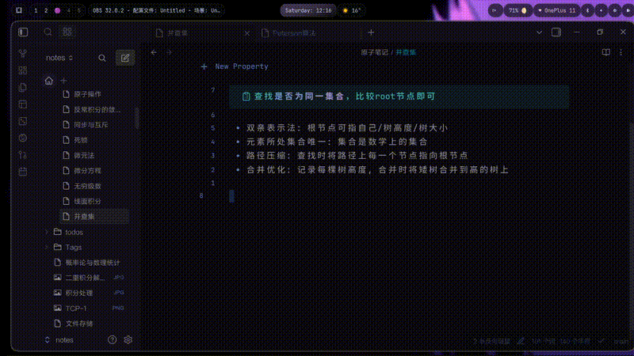
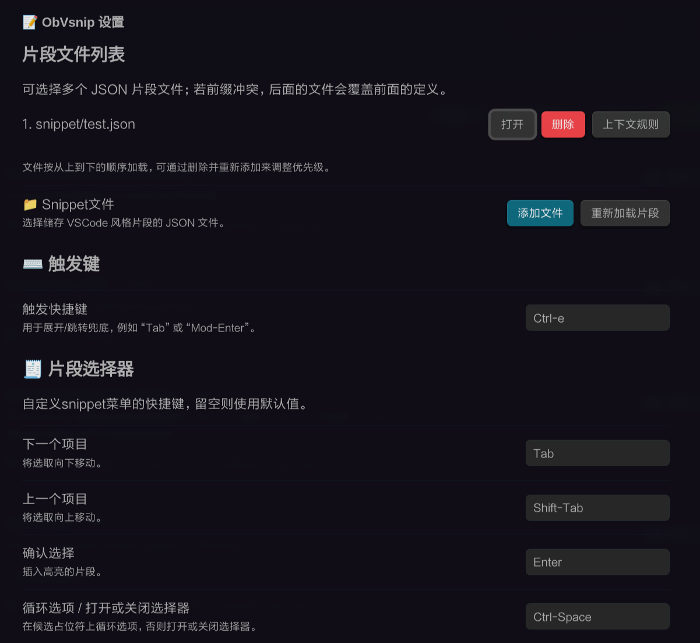
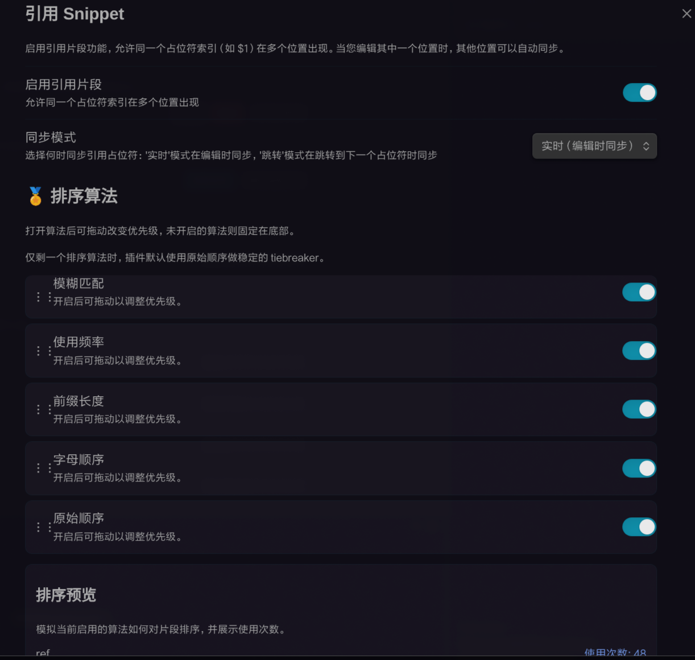
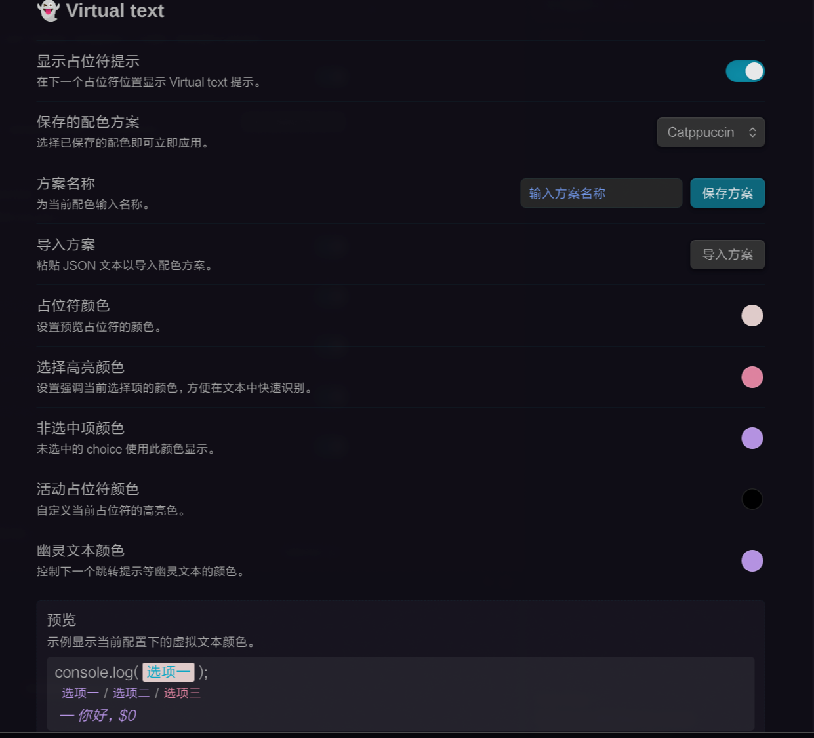

# ObVsnip

> 为 Obsidian 提供 VSCode 风格的代码片段（Snippet）支持

[](LICENSE)
[](https://obsidian.md)

ObVsnip 是一个强大的 Obsidian 插件，为编辑器添加了完整的 VSCode 风格代码片段功能。通过简单的前缀触发，你可以快速插入预定义的代码模板，大幅提升写作和编程效率。



## ✨ 主要特性

### 🚀 核心功能

- **VSCode 兼容格式** - 完全支持标准的 JSON 片段文件格式，可直接使用 VSCode 的片段文件
- **智能前缀匹配** - 基于 Trie 树的高效前缀匹配算法，快速响应
- **TabStop 导航** - 支持 `$1`, `$2` 等占位符的跳转和编辑，轻松导航复杂模板
- **变量替换** - 内置多种实用变量（文件名、日期、剪贴板、时间等）
- **选择列表** - 支持 `${1|option1,option2|}` 格式的选择列表，按 `Ctrl+Space` 循环选择
- **引用同步** - 同一占位符在多个位置自动同步，编辑一处即可更新所有关联位置
- **智能补全菜单** - 可搜索的片段选择界面，支持多种排序算法
- **虚拟文本渲染** - 在编辑器中高亮显示占位符和提示文本，清晰直观
- **使用频率追踪** - 自动记录片段使用情况，智能优化排序

### 🎨 界面特性

- **美观的补全菜单** - 支持描述、前缀匹配、使用频率等多种排序方式
- **可自定义颜色主题** - 内置多种颜色预设（Catppuccin、Tokyonight、GitHub Dark/Light、Dracula 等）
- **虚拟文本高亮** - 清晰显示占位符、激活状态、选择项等
- **多文件支持** - 可以配置多个片段文件，按来源筛选

### ⚙️ 高级功能

- **上下文条件** - 支持根据文件语言、作用域等条件限制片段可用性
- **隐藏片段** - 通过 `hide: true` 隐藏某些片段，使其不出现在菜单中
- **实时同步** - 引用类型 TabStop 支持实时同步和跳转同步两种模式
- **灵活的快捷键** - 可自定义触发键和菜单快捷键
- **调试模式** - 内置调试日志系统，方便问题排查

## 📦 安装

### 使用 BRAT 安装

1. 安装 [BRAT 插件](https://github.com/TfTHacker/obsidian42-brat)
2. 打开 Obsidian 设置
3. 进入 **第三方插件** → **BRAT** → **Beta Plugin List**
4. 点击 **Add Beta Plugin**，输入仓库地址：`JuanZoran/ObVsnip`
5. 点击 **Add Plugin**，然后在插件列表中找到 **ObVsnip** 并启用

### 手动安装

1. 从 [Releases](https://github.com/JuanZoran/ObVsnip/releases) 下载最新版本
2. 将 `main.js`、`manifest.json`、`styles.css` 复制到你的 vault 的 `.obsidian/plugins/obvsnip/` 目录
3. 重启 Obsidian 或重新加载插件

## 🚀 快速开始

### 1. 创建片段文件

在 Obsidian 中创建一个 JSON 文件（例如 `snippets.json`），添加你的代码片段：

```json
{
  "hello": {
    "prefix": "hello",
    "body": "Hello, ${1:World}!",
    "description": "简单的问候语"
  },
  "code-block": {
    "prefix": "cb",
    "body": [
      "```${1:javascript}",
      "$2",
      "```"
    ],
    "description": "代码块模板"
  }
}
```

### 2. 配置插件

1. 打开 Obsidian 设置
2. 找到 **ObVsnip** 设置
3. 在 **Snippet Files** 中添加你创建的片段文件路径（例如：`snippets.json`）
4. 点击 **Reload** 加载片段

### 3. 使用片段

- **自动展开**：输入前缀（如 `hello`），然后按 `Tab` 键
- **打开菜单**：输入前缀后按 `Ctrl+Shift+S`（可自定义）打开补全菜单
- **导航占位符**：按 `Ctrl+Tab` 跳转到下一个占位符，`Ctrl+Shift+Tab` 跳转到上一个

## 📖 使用示例

### 基本占位符

```json
{
  "function": {
    "prefix": "fn",
    "body": "function ${1:functionName}(${2:params}) {\n  ${3:// code}\n}",
    "description": "JavaScript 函数模板"
  }
}
```

使用方法：输入 `fn` → 按 `Tab` → 依次填写函数名、参数、代码

### 选择列表

```json
{
  "variable": {
    "prefix": "var",
    "body": "const ${1:name}: ${2|string,number,boolean|} = ${3:value};",
    "description": "TypeScript 变量声明"
  }
}
```

使用方法：输入 `var` → 按 `Tab` → 在类型占位符处按 `Ctrl+Space` 循环选择类型

### 引用同步

```json
{
  "function-ref": {
    "prefix": "fnref",
    "body": "function ${1:name}() {\n  return ${1};\n}",
    "description": "函数名在多处同步"
  }
}
```

使用方法：输入 `fnref` → 按 `Tab` → 在第一个位置输入函数名，其他位置的 `$1` 会自动同步

### 变量使用

```json
{
  "file-header": {
    "prefix": "header",
    "body": [
      "File: ${TM_FILENAME}",
      "Path: ${TM_FILEPATH}",
      "Created: ${CURRENT_DATE} ${TIME_FORMATTED}",
      "Vault: ${VAULT_NAME}"
    ],
    "description": "文件头信息"
  }
}
```

### 多行片段

```json
{
  "react-component": {
    "prefix": "rfc",
    "body": [
      "import React from 'react';",
      "",
      "export default function ${1:Component}() {",
      "  return (",
      "    <div>",
      "      ${2:// content}",
      "    </div>",
      "  );",
      "}"
    ],
    "description": "React 函数组件"
  }
}
```

更多示例请查看 [snippet-examples.md](docs/snippet-examples.md)

## 🎨 内置变量

ObVsnip 支持以下内置变量：

| 变量 | 说明 | 示例 |
|------|------|------|
| `TM_FILENAME` | 当前文件名（含扩展名） | `note.md` |
| `TM_FILEPATH` | 当前文件路径 | `folder/note.md` |
| `TM_FOLDER` | 当前文件所在文件夹 | `folder` |
| `VAULT_NAME` | 当前仓库名称 | `My Vault` |
| `TM_SELECTED_TEXT` | 当前选中的文本 | `selected text` |
| `TM_CLIPBOARD` | 剪贴板内容（仅桌面版） | `clipboard text` |
| `CURRENT_YEAR` | 当前年份 | `2024` |
| `CURRENT_MONTH` | 当前月份 | `12` |
| `CURRENT_DATE` | 当前日期 | `2024-12-06` |
| `CURRENT_HOUR` | 当前小时（24小时制） | `14` |
| `CURRENT_MINUTE` | 当前分钟 | `30` |
| `CURRENT_SECOND` | 当前秒钟 | `45` |
| `TIME_FORMATTED` | 格式化的时间 | `14:30:45` |

变量也支持默认值，例如：`${TM_FILENAME:unknown}` 如果文件名为空则使用 `unknown`

## ⌨️ 快捷键

### 默认快捷键

| 功能 | 快捷键 | 说明 |
|------|--------|------|
| 展开片段 | `Tab` | 输入前缀后按 Tab 自动展开 |
| 打开菜单 | `Ctrl+Shift+S` | 打开片段选择菜单 |
| 跳转下一个 | `Ctrl+Tab` | 跳转到下一个占位符 |
| 跳转上一个 | `Ctrl+Shift+Tab` | 跳转到上一个占位符 |
| 退出片段模式 | `Esc` 或 `Ctrl+]` | 退出当前片段编辑 |

### 菜单快捷键（在菜单中）

| 功能 | 快捷键 | 说明 |
|------|--------|------|
| 上一个 | `↑` | 选择上一个片段 |
| 下一个 | `↓` | 选择下一个片段 |
| 确认 | `Enter` | 确认选择 |
| 切换 | `Ctrl+Space` | 循环选择列表选项 |
| 切换来源 | `Ctrl+N` / `Ctrl+P` | 切换片段来源 |

所有快捷键都可以在设置中自定义。

## ⚙️ 配置选项

### 基本设置



- **Snippet Files** - 片段文件路径列表，支持多个文件
- **Trigger Key** - 触发键（默认：`Tab`）
- **Show Virtual Text** - 是否显示虚拟文本提示

### 排序算法



可以配置多种排序策略，支持启用/禁用和调整权重：

- **前缀匹配** - 基于前缀匹配度排序
- **使用频率** - 基于历史使用次数排序
- **描述匹配** - 基于描述内容匹配排序
- **最近使用** - 基于最近使用时间排序

### 虚拟文本颜色



- 内置多种颜色主题预设
- 支持自定义颜色
- 可以保存和管理自定义主题

### 参考片段同步

- **实时同步** (`realtime`) - 编辑时立即同步所有关联位置
- **跳转同步** (`on-jump`) - 仅在跳转时同步

## 🎯 使用场景

### 代码编写

- 快速插入函数、类、组件模板
- 统一的代码格式和风格
- 减少重复输入

### 文档写作

- Markdown 格式模板
- 表格、列表模板
- 常用文档结构

### 笔记管理

- 日记模板（自动插入日期）
- 会议记录模板
- 读书笔记模板

## 📚 文档

- [架构文档](docs/architecture.md) - 项目架构和技术细节
- [片段示例](docs/snippet-examples.md) - 详细的片段使用示例
- [实时同步机制](docs/realtime-sync.md) - 引用片段同步机制说明
- [TabStop 策略](docs/tabstop-strategy.md) - TabStop 跳转策略设计

## 🛠️ 开发

### 环境要求

- Node.js >= 18
- npm 或 yarn

### 开发流程

```bash
# 克隆仓库
git clone https://github.com/JuanZoran/ObVsnip.git
cd ObVsnip

# 安装依赖
npm install

# 开发模式（自动构建和同步到测试 vault）
npm run dev

# 构建生产版本
npm run build

# 运行测试
npm test
```

### 项目结构

```
ObVsnip/
├── src/              # 源代码
│   ├── config/       # 配置相关
│   ├── strategies/   # TabStop 策略
│   ├── utils/        # 工具函数
│   └── ...           # 其他模块
├── tests/            # 测试文件
├── docs/             # 文档
├── assets/           # 资源文件
└── build/            # 构建输出
```

更多开发信息请参考 [架构文档](docs/architecture.md)

## 🤝 贡献

欢迎贡献！你可以通过以下方式参与：

- 🐛 [报告 Bug](https://github.com/JuanZoran/ObVsnip/issues)
- 💡 [提出功能建议](https://github.com/JuanZoran/ObVsnip/issues)
- 🔧 [提交 Pull Request](https://github.com/JuanZoran/ObVsnip/pulls)
- 📖 [改进文档](https://github.com/JuanZoran/ObVsnip/pulls)

## 📄 许可证

本项目采用 [MIT 许可证](LICENSE)

## 🙏 致谢

## 📝 更新日志

### v1.0.2

- 初始发布版本
- 支持完整的 VSCode 片段格式
- 引用片段实时同步
- 智能补全菜单
- 虚拟文本渲染
- 使用频率追踪

---

**享受使用 ObVsnip，让代码片段提升你的 Obsidian 体验！** 🚀
